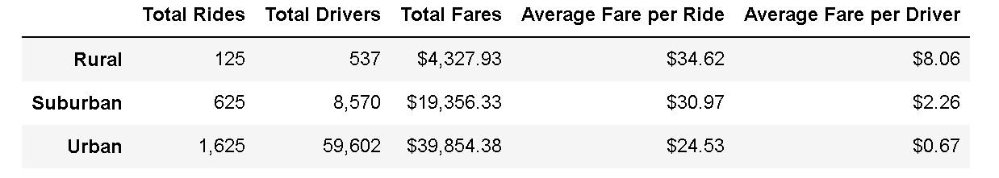

# Pyber
### Overview of the school district analysis

The purpose of this analysis was to provide detailed information about how a rideshare app is used by the population as a means to develop new business plans to implement changes for new growth opportunities.

### Results
There is a description of the differences in ride-sharing data among the different city types. Ride-sharing data include the 
- total rides
  - Rural
  - Suburban
  - Urban   

- total drivers
  - Rural
  - Suburban
  - Urban 

- total fares
  - Rural
  - Suburban
  - Urban 

- average fare per ride 
  - Rural
  - Suburban
  - Urban 

- average fare per driver
  - Rural
  - Suburban
  - Urban 
  
- total fare by city type 
  - Rural
  - Suburban
  - Urban 

  

  

### Summary
There is a statement summarizing three business recommendations to the CEO for addressing any disparities among the city types.

