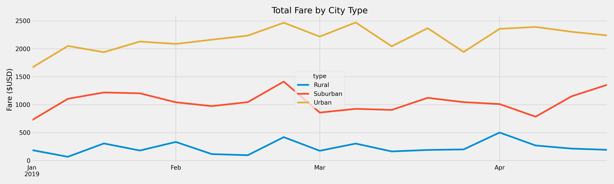

# Pyber
### Overview of the Ride-sharing Data Analysis

The purpose of this analysis was to provide detailed information about how a ride-share app is used by the population as a means to develop new business plans to implement changes for new growth opportunities.

### Results
After completeing the anaylsis, the summary show in the figure below, the differences in ride-sharing data among the different city types is as follows: 

- There were a total of 2375 rides in 2019:
  - 125 total rides for Rural cities
  - 625 rides for Suburban cities
  - 1625 rides for Urban cities 

- Total drivers in 2019 were 2,973:
  - Rural cities there were 78 drivers
  - Suburban cities there were 490 drivers
  - Urban cities had 2,405 drivers

- The total amount of fares in 2019 was $63,538.64

- The amount of total fares was borken further per city type:
  - Rural Cities - $4,327.93
  - Suburban Cities - $19,356.33
  - Urban Cities - $39854.38

- The average fare per ride was calculated by dividing the total fares by the total rides, which resulted in the following:
  - Rural Cities - $34.62
  - Suburban Cities - $30.97
  - Urban Cities - $24.53

- Similarly to the average fare per ride, the average fare per driver was calculated by dividing the total fares collected by the total drivers for each city type. This resulted in the following data:
  - Rural Cities - $55.49
  - Suburban Cities - $39.50
  - Urban Cities - $16.57
  

  

  

### Summary

Using the data from the analysis, it is clear that there is a disparity amoung the different types of cities and their performance. At first glance of the ling graph above, you can see that the amount of money that is generated in Urban cities is several times more than that of the Rural cities and nearly double that of Suburban cities. 

To close the gap, new measures need to be put in place. We need to gain more drivers in rural and suburban cities. To do that I recommend we create an advertisement campaign that tells potential new drivers about the amount of money to be gained if they sign up with Pyber. Using the data from the analysis on the average fares per ride as a basis for whatthey would make. 

The data shows that there is a high density of drivers in the urban cities, we could incentize these drivers to travel out into the suburban and rural cities if we implement a price differential in those city types. This would pull drivers out of the urban cities,  which would potentially result in more rides being completed. This would drive up all other metrics and boost revenue for the company. 

One last suggestion would be that more research is needed to understand why there is such a disparity in the different city types. We do not have enough information to give a proper anaylsis based on the data collected at this moment. obtaining information such as population density and car ownership would be useful to gain further insight.

